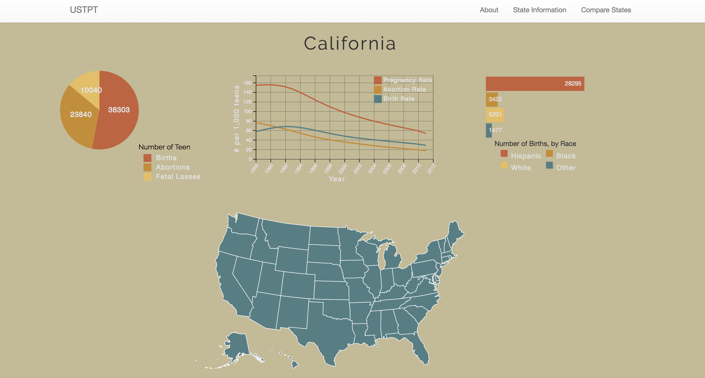
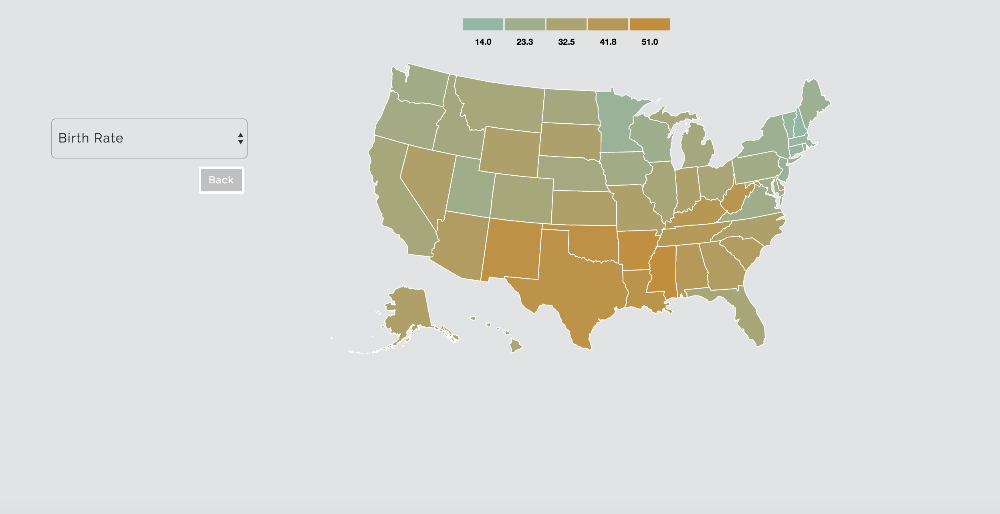

#USTPT 
===

USTPT is a data visualization of teen pregnacy trends in the United States, using a PSQL database, Node, D3.js, and some jQuery. This information comes from a report published by the [Guttmacher Institute](https://www.guttmacher.org/report/us-teen-pregnancy-trends-2011). There was not an exsisting API, for the report, so I decided to create one. 

The project is currently deployed on heroku, <https://ustpt.herokuapp.com/>

The site is divided in two sections. The first section provides three graphs pertainining to a state.  The left graph represents the number of births, abortions, and fetal losses, of women aged 15-19 in 2011. The center graph shows the pregnacy, birth, and abortion rates, of women aged 15-19, from 1988-2011. The right graph represents the number of births, by race of women aged 15-19 in 2011. 

The second section, includes all of the report's table columns and can show a contrast between states based on their value. 

